Made by [School of Computing](https://www.comp.nus.edu.sg/) (SoC) students, for SoC students, SoConnect is a **desktop app for SoC students to manage contacts of Professors and Teaching Assistants, and keep track of noteworthy events.** As SoC students ourselves, we understand how packed your schedules can get and how busy you are. Hence we hope that with SoConnect, you can **save your contacts and events in one location**, **link related contacts and events** - all with just a simple typing of a command. You no longer have to waste time and effort looking for contacts and events from different apps.

SoConnect is **made for students who love to type**. If you **can type fast**, managing your contacts and events will be a **breeze** with SoConnect.

This user guide will **help you** to quickly **familiarise yourself with your SoConnect** and so that you can use the
full range of features it offers.

<h2>Table of Contents</h2>

* Table of Contents
{:toc}

--------------------------------------------------------------------------------------------------------------------

## How to use SoConnect User Guide

Before we jump into learning the [features](#features), here is a quick overview on how to use this user guide.

* You can click on the titles in the Table of Contents to jump to the section that you are interested in.
* You may find these icons in this user guide useful when reading this user guide:
    * **:bulb: Tip** provides additional information that might be useful to you.
    * **:information_source: Note** provides supplementary information that helps you better understand this User Guide.
    * **:exclamation: Caution** warns you against doing certain actions that will lead to undesirable consequences.
* You can find explanations of _italicized_ words in the [Glossary](#glossary).
* You can refer to the [Command Summary](#command-summary) for a complete overview of all SoConnect features and _commands_.

### How to read _commands_ in SoConnect

Before you learn the different _commands_ in [features](#features), let's learn about what makes up a _command_.

You will see _commands_ throughout this User Guide. Each _command_ has its own [_command format_](#command-summary).

Here you see an example of a _command_:

Take note of the **three** different parts that form a _command_:

1. **_COMMAND_ WORD**

   You need to specify the _command_ word to tell SoConnect **what** action you want it to do.

   For example, you can type `cedit` to SoConnect to edit a contact for you.

2. **_PARAMETER_**

   In addition to the _command_ word, you may need to provide **supplementary information** known as _parameters_.

   Continuing on the same example, you can specify `2` to tell SoConnect to edit information about the contact indexed at **index 2** in the [contact list](#overview-of-soconnect) (i.e. Bernice Yu).

3. **_PREFIX_**

   You use prefixes to specify the **type** of *parameters* that you provide.

   Each _prefix_ always **ends with a slash** `/`. See the [list of _prefixes_](#list-of-prefixes) for all the _prefixes_ that you can use in SoConnect.

   For example, if you want to specify a name parameter, you can type `n/`. SoConnect will recognize that the information following this _prefix_ should be a **name**.

You may view the various types of _commands_ that you can type in SoConnect.

**:information_source: About the _command format_:** 

* Words in `UPPER_CASE` are the _parameters_ that you **should provide**. 
  e.g. in following this _command format_ `cadd n/NAME`, you can type `cadd n/John Doe` (i.e. provide `John Doe` as the `NAME` _parameter_).

* **Optional** _fields_ are in **square brackets**. 
  e.g. Both `n/John Doe t/friend` and `n/John Doe` (i.e. omit `t/friend`) are valid.

* _Fields_ **preceding** ellipsis `…` can be used **any number of times** or not at all. 
  e.g. `[t/TAG]…` means the `TAG` parameter can be omitted (used 0 times), or `t/friend` (used once), or `t/friend t/family` (used 3 times), etc.

* Each pair of **_prefixes_ and _parameters_** can be in **any** order. 
  e.g. if the _command format_ specifies `n/NAME [p/PHONE_NUMBER]`, you can either type `n/NAME [p/PHONE_NUMBER]` or`[p/PHONE_NUMBER] n/NAME`.

* If a _parameter_ is expected only once in the _command format_, and if you specify it multiple times, **only the last occurrence** of the _parameter_ will be taken (unless otherwise stated). 
  e.g. if you specify `p/12341234 p/56785678`, only `p/56785678` will be taken.

* Extraneous _parameters_ that you type for _commands_ that do not take in _parameters_ (such as `help` and `exit`) will be **ignored**. 
  e.g. if you type `help 123`, SoConnect will interpret it as `help`.

* Date and time that you specify must follow **dd-MM-yyyy HH:mm** format (day-month-year hours:minutes). 
  e.g. if you want to specify 1 May 2021 6.30pm, you should type `01-05-2021 18:30`.

### How do I know the _command_ I entered is valid?

After you enter a **valid** _command_ in SoConnect, you should see a **success message** displayed in the message box of SoConnect.

For example, after you enter [`clist`](#listing-all-contacts-clist), SoConnect will tell you that it has successfully listed all contacts.

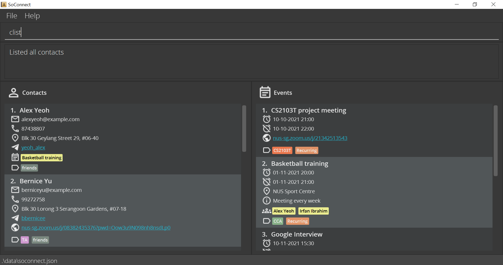

:bulb: **Tip:**

Unsure of where the **message box** is? Click [here](#overview-of-soconnect) to get an overview of different components in the SoConnect display.

 

### What happens if my _command_ is invalid?

However, if the _command_ you entered **does not follow the _command format_** specified in [Features](#features), you will see an **error message** in the message box instead.
You can then correct the error in the _command_ you entered and try again.

For example, if you enter [`cview`](#viewing-a-contact-cview) **without** specifying which contact to view, SoConnect will tell you that the _command format_ is invalid.

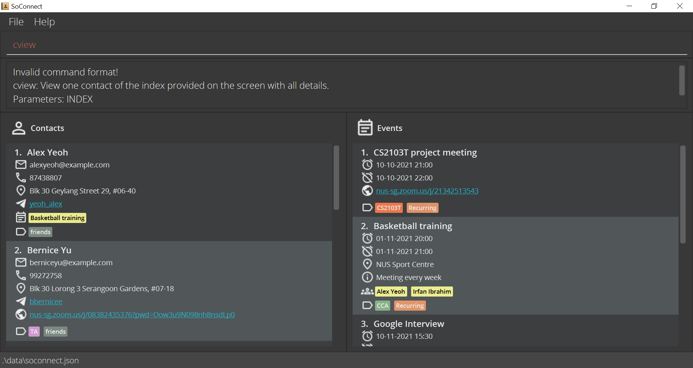

---------------------------------------------------------------------------------------------------------------
## Quick start

Follow this simple 5-step instructions to **set up** SoConnect on your computer. 

1. First, ensure you have [Java 11](https://docs.oracle.com/en/java/javase/11/install/overview-jdk-installation.html#GUID-8677A77F-231A-40F7-98B9-1FD0B48C346A) or above installed on your computer.

   
:bulb: **Tip:**

   [Here](https://www.java.com/en/download/help/version_manual.html) is how you can check the Java Version installed on your computer.
   

2. Next, download the latest `soconnect.jar` file [here](https://github.com/AY2122S1-CS2103T-W15-3/tp/releases).

   
:bulb: **Tip:**

   What is a jar file? Click [here](https://www.lifewire.com/jar-file-4138386) to find out more
   

3. Then, copy the file to the folder you want to use as the _home folder_ for your SoConnect.
   
   

4. Then, **double-click** the file to start SoConnect. You should see a similar display on your screen: 

   

    
:information_source: **Note:**
   SoConnect comes with some sample contacts and events upon installation.
    

    
:bulb: **Tip:**
   If SoConnect does not start by double-clicking, you can try this 
   [alternative](#how-to-start-soconnect-using-terminal) way of starting SoConnect.
    

5. Lastly, type a _command_ in the _command_ box and **press Enter** to execute it.

    
:bulb: **Tip:**
   Unsure of where the **_command_ box** is? Click [here](#overview-of-soconnect) to check out the
   overview of different components in SoConnect.
    

   For example, you can type `help` and **press Enter** to open the [help window](#viewing-help-help). 
   Here are some example _commands_ you can try:

    * `elist`: [Lists all events](#listing-all-events-elist).

    * `cadd n/John Doe p/98765432 e/johnd@example.com a/John street, block 123, #01-01`:
   [Adds a contact](#adding-a-contact-cadd) named `John Doe` to SoConnect.

    * `cdelete 2` : [Deletes the second contact](#deleting-a-contact-cdelete) (i.e. Bernice Yu) from the [contact list](#overview-of-soconnect).

    * `eclear` : [Clears all event entries](#clearing-all-events-eclear) in the [event list](#overview-of-soconnect).

    * `exit` : [Closes](#exiting-soconnect-exit) the SoConnect app.

_See also: [What happens if my command is invalid](#what-happens-if-my-command-is-invalid)_

With everything set up and working, let's understand the SoConnect [display](#overview-of-soconnect).

---------------------------------------------------------------------------------------------------------------

## Overview of SoConnect

Just before you learn the [features](#features) of SoConnect, let's look at what makes up the SoConnect display.

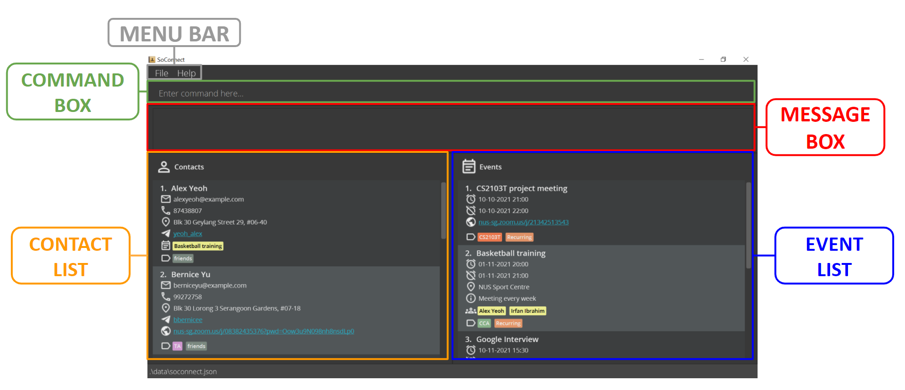

You should see a similar screen display when you open SoConnect!

1. **Menu Bar**

   The Menu Bar consists of **two** tabs: `File` and `Help`.

   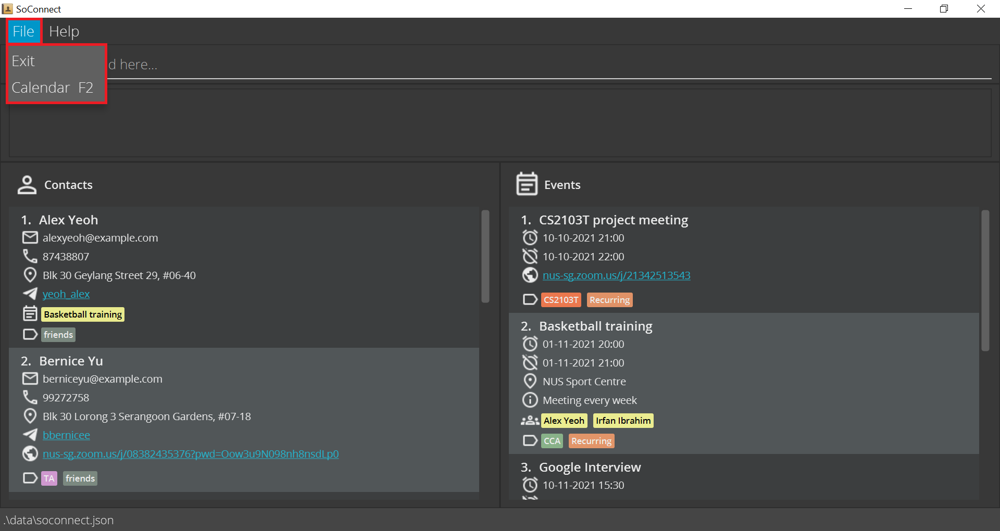

   Upon clicking `File`, you can choose to:
    1. **Exit** SoConnect <u>or</u>
       
    2. Open **Calendar** of SoConnect
   
     

   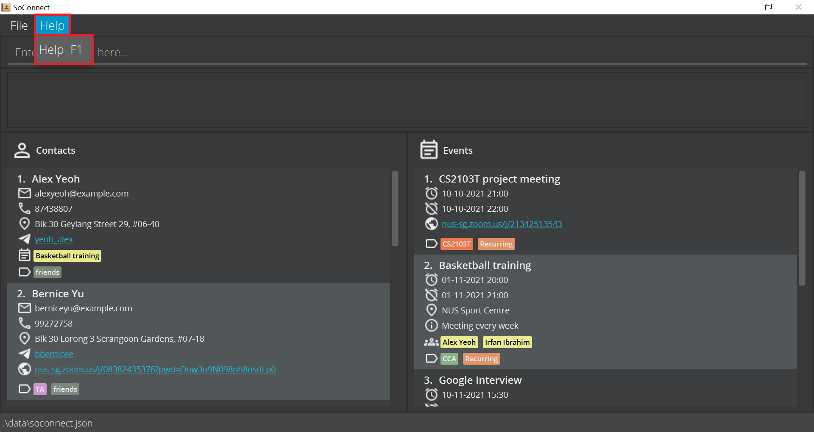

   Upon clicking `Help`, you can choose to open the **Help Window** of SoConnect.

    
:bulb: **Tip:**
    Click the following links to see how to [open the help window](#viewing-help-help), [exit SoConnect](#exiting-soconnect-exit) and [open the calendar](#opening-the-calendar-calendar) using _commands_.
    

2. **_Command_ Box**

   This is where you can type your _commands_ to use the [features of SoConnect](#features).

3. **Message Box**

   This is where the message from SoConnect is displayed after you have entered a _command_.

   _See Also: [What happens if my command is invalid?](#what-happens-if-my-command-is-invalid)_

5. **Contact List**

   Displays information of the **contacts** you saved in SoConnect.

   Refer to [Icons](#icons) to learn about the different _fields_ that each icon represents in contact list.

6. **Event list**

   Displays information of the **events** you saved in SoConnect.

   Refer to [Icons](#icons) to learn about the different _fields_ that each icon represents in the event list.

### Icons

You will **always** find these **two** information of each contact displayed in the contact list:
1. Contact **Index**
2. Contact **Name**

Similarly, you will **always** find these **two** information of each event displayed in the event list:
1. Event **Index**
2. Event **Name**

Here are the icons you might see in each contact or event:

<table>
    <thead>
        <tr>
            <th colspan="2" class="contact-heading">Contact icons</th>
            <th colspan="2" class="event-heading">Event icons</th>
        </tr>
        <tr>
            <th class="contact-heading">Icon</th>
            <th class="contact-heading"><em>Field</em></th>
            <th class="event-heading">Icon</th>
            <th class="event-heading"><em>Field</em></th>
        </tr>
    </thead>
    <tbody>
        <tr>
            <td>
                
            </td>
            <td>
                Bookmark*
            </td>
            <td>
                
            </td>
            <td>
                Bookmark*
            </td>
        </tr>
        <tr>
            <td>
                
            </td>
            <td>
                Email Address
            </td>
            <td>
                
            </td>
            <td>
                Start Time
            </td>
        </tr>
        <tr>
            <td>
                
            </td>
            <td>
                Phone Number
            </td>
            <td>
                
            </td>
            <td>
                End Time
            </td>
        </tr>
        <tr>
            <td>
                
            </td>
            <td>
                Address
            </td>
            <td>
                
            </td>
            <td>
                Address
            </td>
        </tr>
        <tr>
            <td>
                
            </td>
            <td>
                Telegram Handle
            </td>
            <td>
                
            </td>
            <td>
                Description
            </td>
        </tr>
        <tr>
            <td>
                
            </td>
            <td>
                Links/ Websites
            </td>
            <td>
                
            </td>
            <td>
                Links/ Websites
            </td>
        </tr>
        <tr>
            <td>
                
            </td>
            <td>
                Linked Events
            </td>
            <td>
                
            </td>
            <td>
                Linked Contacts
            </td>
        </tr>
        <tr>
            <td>
                
            </td>
            <td>
                Tag
            </td>
            <td>
                
            </td>
            <td>
                Tag
            </td>
        </tr>
    </tbody>
</table>

*The bookmark icon is **visible** only if the contact <u>or</u> event **has been marked**.
_See also: [Marking a contact](#marking-a-contact-cmark) and [Marking an event](#marking-an-event-emark)_

---------------------------------------------------------------------------------------------------------------

## Features

Now, you are ready to learn some new commands. 

There are **three** main sections to SoConnect Features:
[Contact Management](#contact-management), [Event Management](#event-management), and [General](#general).

For each feature, you are provided with:
* **Function and Description** of the feature
* **_Command Format_** of the feature
* **Examples** of some usages of the feature (All examples use the **initial sample** of contacts and events)

:bulb: **Tip:**

If you are just <u>starting off</u>, we recommend that you learn the **basic** features in each section first. 
If you are <u>feeling adventurous</u>, we welcome you to learn the more **advanced** features SoConnect has to offer.

---------------------------------------------------------------------------------------------------------------

### Contact Management

This section details all the features and _commands_ available in SoConnect that can help you manage your **contacts**:

**Basic** features:
* [Adding a contact](#adding-a-contact-cadd)
* [Deleting a contact](#deleting-a-contact-cdelete)
* [Editing a contact](#editing-a-contact-cedit)
* [Finding contacts](#finding-contacts-cfind)
* [Listing all contacts](#listing-all-contacts-clist)

**Advanced** features:  
* [Clearing all contacts](#clearing-all-contacts-cclear)
* [Marking a contact](#marking-a-contact-cmark)
* [Unmarking a contact](#unmarking-a-contact-cunmark)
* [Viewing a contact](#viewing-a-contact-cview)

#### Adding a contact: `cadd`

You can use `cadd` to add the contacts of people such as your Professors and tutors.

**Format:** `cadd n/NAME e/EMAIL [p/PHONE_NUMBER] [a/ADDRESS] [th/TELEGRAM_HANDLE] [z/ZOOM] [t/TAG]…`

:bulb: **Tip:**

* You can add a contact with any number of tags (including 0)
* You **cannot** add a contact with the **same name** as an **existing** contact.
* You can refer to the following [list of _prefixes_](#list-of-prefixes) to see which _prefix_ to use.

**Examples:**

{: .example-table}
**Input 1** | `cadd n/Alex Doe e/e0123456@u.nus.edu a/COM1 #99-99 th/johnDoe99 t/Professor`
**Expected Output 1** | You should see `Alex Doe` added **at the end** of your contact list.   
| |
**Input 2** | `cadd n/ Jon Cheng t/TA e/e7654321@u.nus.edu a/COM1-0201 p/87654321 t/Senior th/jonnyjohnny z/https://nus-sg.zoom.us/j/0123456789?pwd=ABCDEFGHIJKLMNOPDJFHISDFSDH`
**Expected Output 2** | You should see `Jon Cheng` added **at the end** of your contact list.   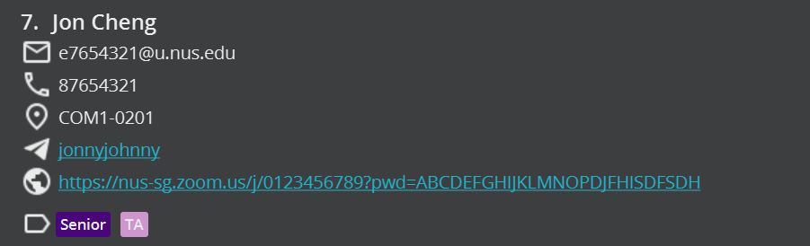

* The index of the newly added contact will be one more than the previous number of contacts.

#### Deleting a contact: `cdelete`

You can use `cdelete` to delete a contact that you may have added mistakenly.

**Format:** `cdelete INDEX1[-INDEX2]`

* Deletes the contact(s):
    * at the specified `INDEX1` <u>or</u>
    * between the specified range from `INDEX1` to `INDEX2` **inclusively** (if you provide `INDEX2`).
* `INDEX1` and `INDEX2` refer to the index numbers shown in the displayed contact list.

:bulb: **Tip:**

* `INDEX1` and `INDEX2` **must be positive integers**. e.g. 1, 2, 3, …
* `INDEX1` and `INDEX2` must **not be greater** than the **number of contacts** in the contact list.

**Examples:**

{: .example-table}
**Input 1** | [`clist`](#listing-all-contacts-clist) followed by `cdelete 2`
**Expected Output 1** | Deletes the second contact in the contact list.   1. After entering `clist`, you should see the **full list of contacts** in the contact list.  2. After entering `cdelete2`, you should **not** see `Bernice Yu` contact in the contact list after the operation.    
| |
**Input 2** | [`cfind Bernice`](#finding-contacts-cfind) followed by `cdelete 1`
**Expected Output 2** | Deletes the first contact from the **results of the `cfind` _command_**.    1. After entering `cfind Bernice`, you should see only contacts with names containing `Bernice` in the contact list.  2. After entering `cdelete 1`, you should see the first contact in the new list removed.    
| |
**Input 3** | `cdelete 3-5`
**Expected Output 3**| Deletes contacts from indexes **3 to 5 (inclusive)** from the **currently displayed** contact list.    You should see the **third, fourth, and fifth** contacts (i.e. `Charlotte Oliveiro`, `David Li` and `Irfan Ibrahim`) removed from the contact list.    

#### Editing a contact: `cedit`

You can use `cedit` to edit the information of your contacts that might have been changed or entered incorrectly.  

**Format:** `cedit INDEX [n/NAME] [e/EMAIL] [p/PHONE] [a/ADDRESS] [th/TELEGRAM_HANDLE] [z/ZOOM] [dt/TAG_DELETED]… [t/TAG_ADDED]… `

:bulb: **Tip:** 

You must provide **at least one** of the optional _fields_.

* Edits the contact at the specified `INDEX`.
* `INDEX` refers to the index number shown in the displayed contact list.
* The input values you provide will be used to update the existing _fields_.
* You can use `t/` to **add** a tag.
* You can **remove** an existing tag by typing `dt/` followed by the name of the tag that you wish to remove.
* You can **remove all** tags of a contact by typing `dt/*`.
* When editing tags, the tags to be deleted will be removed first, before new tags are added.

:bulb: **Tip:**

* `INDEX` **must be a positive integer**. e.g. 1, 2, 3, …
* `INDEX` must **not be greater** than the **number of contacts** in the contact list.
* You **cannot** edit a contact to the **same name** as an existing contact.
* You can refer to the following [**list of _prefixes_**](#list-of-prefixes) to see which _prefix_ to use.

**Examples:**

{: .example-table}
**Input 1** | `cedit 2 p/91234567 e/agentX@thehightable.com`
**Expected Output 1** | Edits the phone number and email address of the second contact in the **currently displayed** contact list to be `91234567` and `agentX@thehightable.com` respectively.    You should see the following changes: 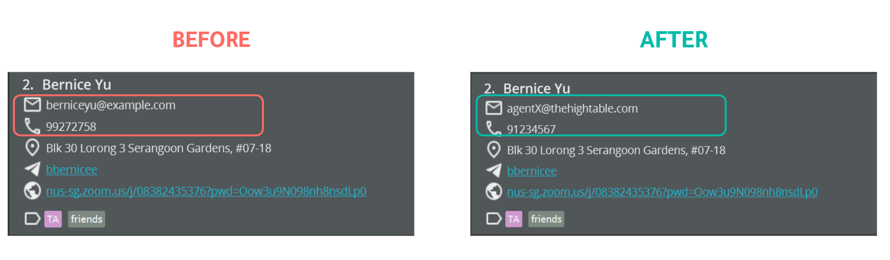
| |
**Input 2** | `cedit 1 n/Betsy Crower dt/*`
**Expected Output 2** | Edits the name of the first contact in the **currently displayed** contact list to be `Betsy Crower` and clears all existing tags.   You should see the following changes: 

#### Finding contacts: `cfind`

You can use `cfind` to search for specific contact(s) by name or other _fields_.

**Format:** `cfind [KEYWORD]… [e/KEYWORD…] [p/KEYWORD…] [a/KEYWORD…] [th/KEYWORD…] [z/KEYWORD…] [t/KEYWORD…]`

:bulb: **Tip:**

There are **two** types of contact searches you can do in SoConnect:
1. If you **do not specify any _prefix_** in front of the keywords you specify, e.g. `cfind KEYWORD1 KEYWORD2`,

   SoConnect will only search the **names** of the contacts using the keywords you provide, **by default**.

2. If you specify **any _prefix_** before your keyword(s), e.g. `cfind e/KEYWORD1 p/KEYWORD2`,

   SoConnect will search the emails and phone numbers of the contacts using `KEYWORD1` and `KEYWORD2` respectively.

* You must provide **at least one keyword**.
* You can provide **multiple keywords** for each _field_ e.g. `cfind John David` or `cfind a/Clementi 123`.
* You can only **specify each optional _field_ once**.
* You can specify the keywords **in any order**. e.g. Both `Hans Bo` and `Bo Hans` will display the same result.
* Partial words can be matched e.g. `Han` will match `Hans`.
* The contact(s) matching at least one keyword provided will be displayed.
  e.g. `Hans Bo` will return `Hans Gruber` and `Bo Yang`.

:bulb: **Tip:**

The search by `cfind` is case-insensitive. e.g. `hans` will match `Hans`.

**Examples:**

{: .example-table}
**Input 1** | `cfind alex david`
**Expected Output 1** | Displays the contacts with names that contain `alex` and `david`.    You should see only these **two contacts** in the contact list: 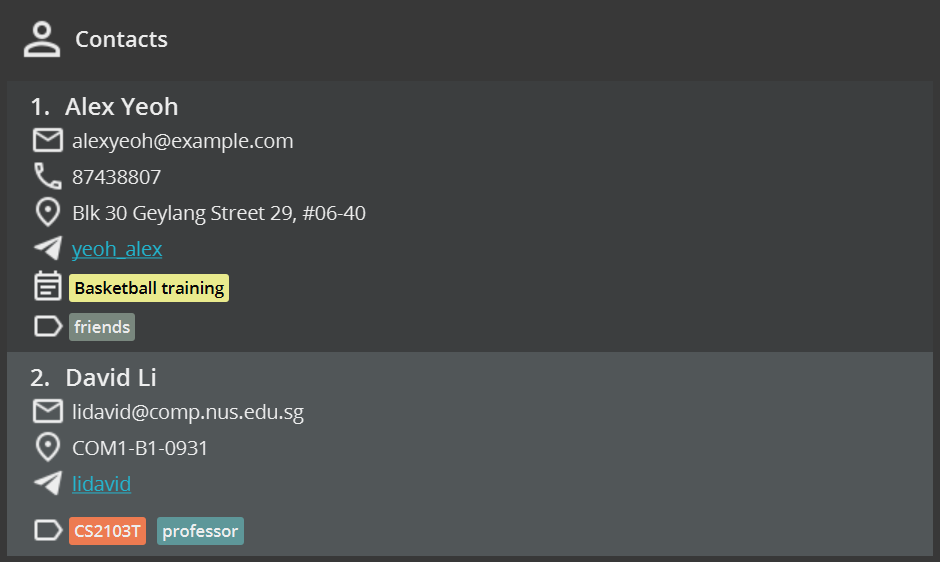
| |
**Input 2** | `cfind p/926 e/nus.edu`
**Expected Output 2** | Displays the contacts with phone numbers that contain `926` <u>or</u> with emails that contain `nus.edu`.   You should see only these **two contacts**: 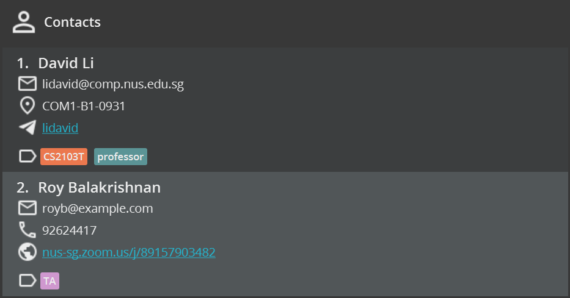

#### Listing all contacts: `clist`

You can use `clist` to view the list of all contacts.

**Format:** `clist [e/] [p/] [a/] [th/] [z/] [t/]`

* Names of contacts are **always** displayed.
* If you do not provide any optional _prefixes_, e.g `clist`, **all available details** of each contact will be shown, **by default**.
* If you **provide optional _prefixes_**, SoConnect will only show the **names and the corresponding _fields_** of those _prefixes_ for each contact.
* You can provide more than one optional _prefix_.
* You can specify the optional _prefix_ **in any order**. e.g. both `clist e/ p/` and `clist p/ e/` will show only the names, email addresses and phone numbers of each contact.
* _Fields_ of a contact that have **no value will not appear** e.g. if a contact does not have a zoom link, typing `clist z/` will not display the zoom link of this contact.
* You can refer to the following [list of _prefixes_](#list-of-prefixes) to see which _prefix_ you can use.

:bulb: **Tip:**

Do not add extraneous values after each optional _prefix_ you specify.

**Examples:**

{: .example-table}
**Input 1** | `clist`
**Expected Output 1** | Shows **all available details** of each contact in SoConnect.   You should see **all your contacts** in the contact list.
| |
**Input 2** | `clist e/ p/`
**Expected Output 2** | Shows **only** the names, email addresses and phone numbers (if available) of each contact in SoConnect.    You should see the contacts list displays **only the specified _fields_**: 

#### Clearing all contacts: `cclear`

You can use `cclear` to delete all contacts.

**Format:** `cclear`

:bulb: **Tip:**

This **will not change the events** saved in SoConnect. 

#### Marking a contact: `cmark`

You can use `cmark` to mark your favorite contacts, such as Professors and tutors of the modules you are taking for the current semester.

**Format:** `cmark INDEX [INDEX]...`

* Marks the contact indexed at `INDEX` and **pins it at the top** of the contact list.
* `INDEX` refers to the index number shown in the **currently displayed** contact list.
* You may mark **more than one** contact by specifying multiple indexes, e.g. `cmark 1 2`.
* Note that the marked contacts appear in **reverse order** to the order in which you specify their corresponding indexes. e.g. `cmark 1 2` will result in the contact originally at index 2 pinned above the contact originally at index 1 (for an illustration, see example 2).

:bulb: **Tip:**

* `INDEX` **must be a positive integer**, e.g. 1, 2, 3,…
* `INDEX` must **not be greater** than the **number of contacts** in the contact list.

**Examples:**

{: .example-table}
**Input 1** | `cmark 2`
**Expected Output 1** | Marks the **second** contact of the **currently displayed** contact list in SoConnect.    You should see `Bernice Yu` **pinned to the top** of your contact list with the **Bookmark Icon**: 
| |
**Input 2** | `cmark 4 5`
**Expected Output 2** | Marks the **fourth and fifth** contacts of the **currently displayed** contact list in SoConnect.    You should see `Irfan Ibrahim` and `David Li` **pinned to the top** of your contact list **in that order** with the **Bookmark Icon**: 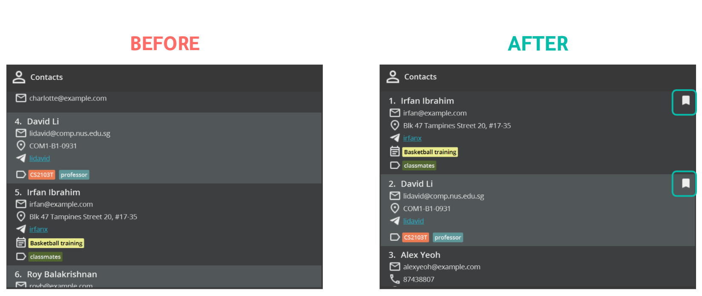

_See also: [Unmarking a contact](#unmarking-a-contact-cunmark)_

#### Unmarking a contact: `cunmark`

You can use `cunmark` to unmark marked contacts, such as Professors and tutors after you have completed the semester.

**Format:** `cunmark INDEX [INDEX]...`

* Unmarks the contact at the specified `INDEX`.
* `INDEX`  refers to the index number shown in the displayed contact list.
* You may unmark **more than one contact at a time** by specifying multiple indexes, e.g. `cunmark 1 2`
* If more than one `INDEX` is specified, the contacts will appear in the **same order** as the specified (for an illustration see example 2).

:bulb: **Tip:**

* `INDEX` **must be a positive integer**, e.g. 1, 2, 3,…
* `INDEX` must **not be greater** than the **number of contacts** in the contact list.
*  You must check that the contact indexed at `INDEX` is **initially marked**.

**Examples:**

{: .example-table}
**Input 1** | [`cmark 2 3`](#marking-a-contact-cmark) followed by `cunmark 1`
**Expected Output 1** | Unmarks the first contact of the **currently displayed** contact list in SoConnect.    You should see `Charlotte Oliveiro` moved to the **bottom of your marked contact list** without the **Bookmark Icon**: 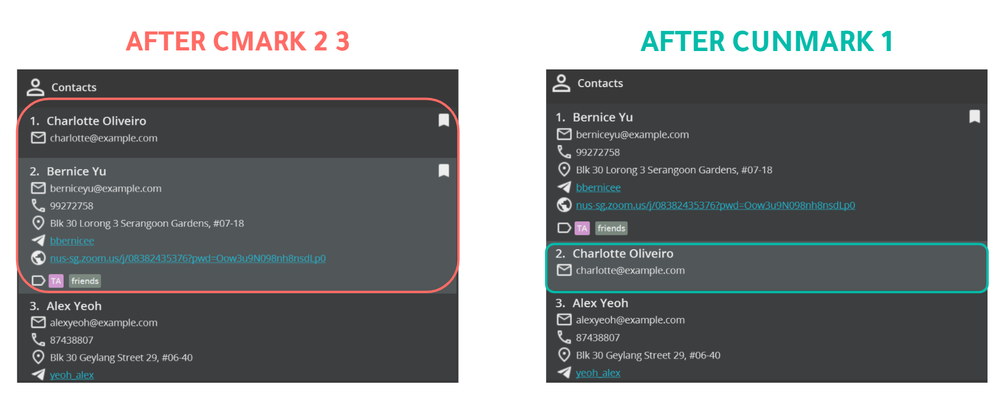
| |
**Input 2** | [`cmark 1 2 3`](#marking-a-contact-cmark) followed by `cunmark 1 2`
**Expected Output 2** | Unmarks the first and second contact of the **currently displayed** contact list in SoConnect.    You should see `Bernice Yu` and `Charlotte Oliveiro` moved to the **bottom of your marked contact list in that order** without the **Bookmark Icon**: 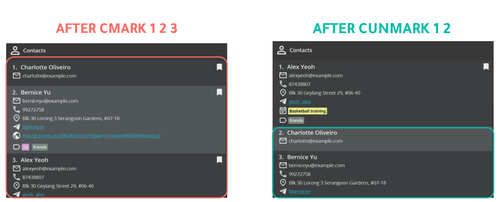

_See also: [Marking a contact](#marking-a-contact-cmark)_

#### Viewing a contact: `cview`

You can use `cview` to view the full details of a contact. This is particularly useful if your contact has a very long _field_, like a long address or a long website.

**Format:** `cview INDEX`

* Displays only the contact at the specified `INDEX`.
* All **truncated** details of the contact you want to view will be **expanded fully**.
* `INDEX` refers to the index number shown in the displayed contact list.

**:bulb: Tip:**  
* `INDEX` **must be a positive integer**. e.g. 1, 2, 3, …  
* `INDEX` must **not be greater** than the **number of contacts** in the contact list.

**Examples:**

{: .example-table}
**Input 1** | `cview 2`
**Expected Output 1** | Shows all details of the second contact of the **currently displayed** in SoConnect **fully**.    You should see this change in your **viewed** contact: 

### Event Management

This section details all the features and _commands_ available in SoConnect that can help you with managing your **events**:

**Basic** features:
* [Adding an event](#adding-an-event-eadd)
* [Deleting an event](#deleting-an-event-edelete)
* [Editing an event](#editing-an-event-eedit)
* [Finding events](#finding-events-efind)
* [Listing all events](#listing-all-events-elist)

**Advanced** features:
* [Clearing all event](#clearing-all-events-eclear)
* [Marking an event](#marking-an-event-emark)
* [Unmarking an event](#unmarking-an-event-eunmark)
* [Viewing an event](#viewing-an-event-eview)
* [Sorting events](#sorting-events-esort)
* [Linking an event to contacts](#linking-an-event-to-contacts-elink)  
* [Unlinking an event from contacts](#unlinking-an-event-from-contacts-eunlink)

#### Adding an event: `eadd`

You can use `eadd` to add your events such as lectures and tutorials.

**Format:** `eadd n/NAME at/START_TIME [end/END_TIME] [d/DESCRIPTION] [a/ADDRESS] [z/ZOOM] [t/TAG]…`

:bulb: **Tip:**

* The event you add can have **any number** of tags (including 0)
* You **cannot** add an event with the **same name** as an **existing** event.
* You can refer to the following [list of _prefixes_](#list-of-prefixes) to see which _prefix_ to use.

:information_source: **Note:**

* Start time and End Time should be in the format **dd-MM-yyyy HH:m** (day-month-year hours:minutes).
* End Time should be **chronologically after** the Start Time.

**Examples:**

{: .example-table}
**Input 1** | `eadd n/Summer Party at/12-12-2021 15:12 a/123, Clementi Rd, 1234665 t/fun`
**Expected Output 1** | A new event is added to the bottom of the event list.   You should also see `Summer Party` **at the end** of your event list: 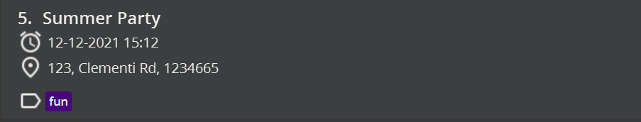

* Index of the newly added event will be one more than the current number of events.

#### Deleting an event: `edelete`

You can use `edelete` to delete events that are outdated or added mistakenly.

**Format:** `edelete INDEX1[-INDEX2]`

* Deletes the event(s):
    * at the specified `INDEX1` <u>or</u>
    * between the specified range from `INDEX1` to `INDEX2` **inclusively** (if you provide `INDEX2`).
* `INDEX1` and `INDEX2` refer to the index numbers shown in the displayed event list.

:bulb: **Tip:**

* `INDEX1` and `INDEX2` **must be positive integers**. e.g. 1, 2, 3, …
* `INDEX1` and `INDEX2` must **not be greater** than the **number of events** in the event list.

**Examples:**

{: .example-table}
**Input 1** | [`elist`](#listing-all-events-elist) followed by `edelete 2`
**Expected Output 1** | Deletes the second event from SoConnect. 
| |
**Input 2** | [`efind Class`](#finding-events-efind) followed by `edelete 1`
**Expected Output 2** | Deletes the first event from the **results of the `efind` _command_**.
| |
**Input 3** | `edelete 1-2`
**Expected Output 3** | Deletes events from index **1 to 2 (inclusive)** from the **currently displayed** event list. 

_*The expected changes are similar to [`deleting a contact`](#deleting-a-contact-cdelete)_

#### Editing an event: `eedit`

You can use `eedit` to update the information of your events that might have been changed or entered incorrectly.

**Format:** `eedit INDEX [n/NAME] [at/START_TIME] [end/END_TIME] [d/DESCRIPTION] [a/ADDRESS] [z/ZOOM] [dt/TAG_DELETED]…​ [t/TAG_ADDED]…`

:bulb: **Tip:** 

You must provide **at least one** of the optional _fields_.

* Edits the event at the specified `INDEX`.
* `INDEX` refers to the index number shown in the displayed event list.
* The values you provide will be used to update the existing _fields_.
* You can use `t/` to **add** a tag.
* You can **remove** an existing tag by typing `dt/` followed by the name of the tag that you wish to remove.
* You can **remove all tags** of an event by typing `dt/*`.
* When editing tags, the tags to be deleted will be removed first, before new tags are added.

:bulb: **Tip:**

* `INDEX` **must be a positive integer**. e.g. 1, 2, 3, …
* Start time and End Time should be in the format **dd-MM-yyyy HH:mm** (day-month-year hours:minutes).
* End Time should be **chronologically after** the Start Time.
* You **cannot** edit an event to the **same name** as an existing event.
* * You can refer to the following [**list of _prefixes_**](#list-of-prefixes) to see which _prefix_ to use.

**Examples:**

{: .example-table}
**Input 1** | `eedit 2 n/CS2103T Exam dt/CCA t/Hard`
**Expected Output 1** | Changes the name of the second event in the **currently displayed** event list to `CS2103T Exam`, deletes the tag `CCA` and adds the tag `Hard`.    You should see these changes: 

#### Finding events: `efind`

You can use `efind` to search for specific event(s) by name or other _fields_.

**Format:** `efind [KEYWORD]… [at/KEYWORD…] [end/KEYWORD…] [d/KEYWORD…] [a/KEYWORD…] [z/KEYWORD…] [t/KEYWORD…]`

:bulb: **Tip:**

There are **two** types of event searches you can do in SoConnect:
1. If you **do not specify any _prefix_** in front of the keywords you specify, e.g. `efind KEYWORD1 KEYWORD2`,

   SoConnect will only search the **names** of the events using the keywords you provide, **by default**.

2. If you specify **any _prefix_** before your keyword(s), e.g. `efind a/KEYWORD1 d/KEYWORD2`,

   SoConnect will search the addresses and descriptions of the events using `KEYWORD1` and `KEYWORD2` respectively.

* You need to provide **at least one keyword**.
* You can provide **multiple keywords** for each _field_ e.g. `efind Test Exam` or `efind d/study revise`.
* You can only **specify each optional _field_ once**.
* * You can specify the keywords **in any order**. e.g. Both `Test Exam` and `Exam Test` will display the same result.
* Partial words can be matched e.g. `Exa` will match `CS2103T Exam`.
* The events(s) matching at least one keyword provided will be displayed.
  e.g. `Exam Hard` will return `Hard Exam`, `CS1101S Exams`.

:bulb: **Tip:**

The search by `efind` is case-insensitive. e.g. `exams` will match `Exams`.

**Examples:**

{: .example-table}
**Input 1** | `efind meet`
**Expected Output 1** | Displays events with names that contain `meet`.    You should see only this **one event**: 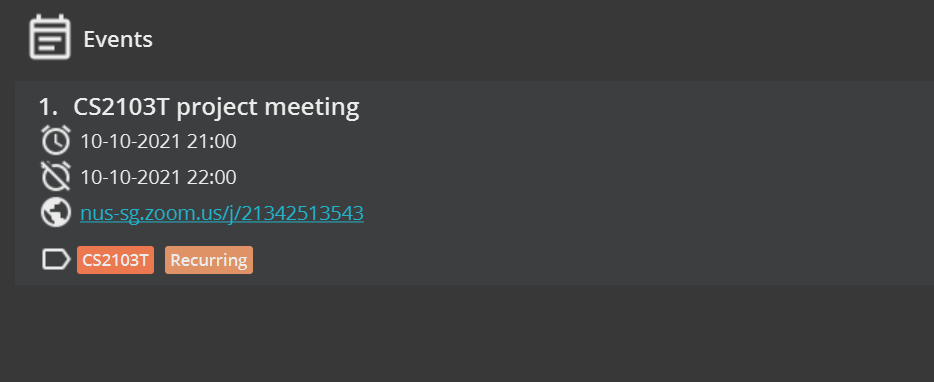
| |
**Input 2** | `efind t/CS2103T Intern`
**Expected Output 2** | Displays events with tags that contain `CS2103T` and `Intern`.   You should see only these **two events**: 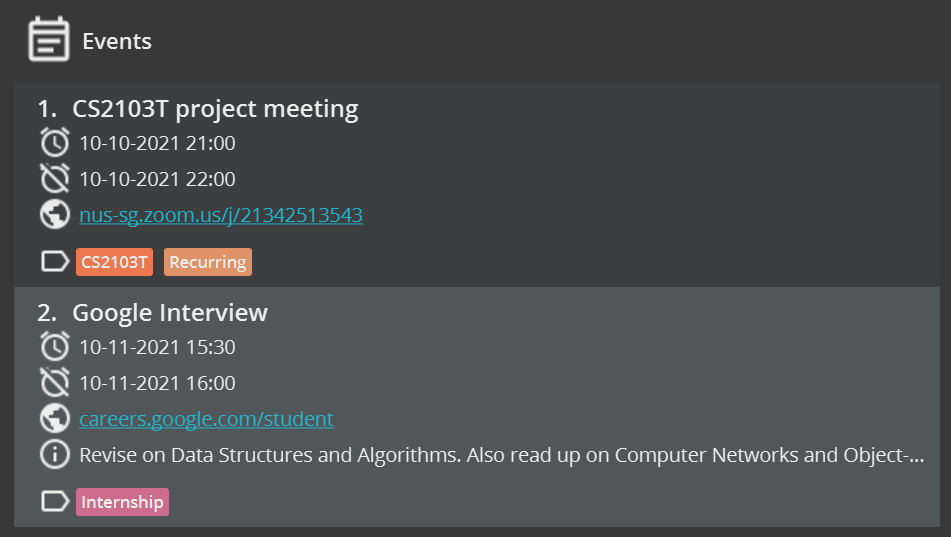

#### Listing all events: `elist`

You can use `elist` to view the list of all events, such as your lectures, tutorials and exams.

**Format:** `elist [at/] [end/] [d/] [a/] [z/] [t/]`

* Event names are **always** displayed.
* If you do not provide any optional _prefixes_, e.g. `elist` , **all available details** of each event will be shown, by default.
* If you **provide optional _prefixes_**, SoConnect will only show the **names and the corresponding _fields_** for each event.
* You can provide more than one optional _prefix_.
* You can specify the optional _prefix_ **in any order**. e.g. both `elist d/ at/` and `elist at/ d/` will only show the names, descriptions and starting times of each event.
* _Fields_ of a contact that have **no value will not appear** e.g. if an event does not have a zoom link, typing `elist z/` will not display the zoom link of this event.
* You can refer to the following [list of _prefixes_](#list-of-prefixes) to see which _prefix_ you can use.

:bulb: **Tip:**

Do not add extraneous values after each optional _prefix_ you specify.

**Examples:**

{: .example-table}
**Input 1** | `elist`
**Expected Output 1** | Shows **all available details** of each event in SoConnect.    You should see **all your events** in the event list.
| |
**Input 2** | `elist d/ at/`
**Expected Output 2** | Shows **only** their names, start date and time and description (if available) of each event in SoConnect.   You should also see the event list displays all events with **only the specified _fields_**: 

#### Clearing all events: `eclear`

You can use `eclear` to delete all events.

**Format:** `eclear`

:bulb: **Tip:**

This **will not change the contacts** saved in SoConnect. 

#### Marking an event: `emark`

You can use `emark` to mark noteworthy events, such as recurring lectures and tutorials of the modules you are taking for the current semester.

**Format:** `emark INDEX [INDEX]…`

* Marks the event indexed at `INDEX` and **pins it at the top** of the event list.
* `INDEX` refers to the index number shown in the **currently displayed** event list.
* You may mark **more than one** event by specifying multiple indexes, e.g. `emark 1 2`.
* Note that the marked events appear in **reverse order** to the order in which you specify their corresponding indexes. e.g. `emark 1 2` will result in the event originally at index 2 pinned above the event originally at index 1 (for an illustration, see example 2 in [Marking a contact](#marking-a-contact-cmark)).

:bulb: **Tip:**

* `INDEX` **must be a positive integer**, e.g. 1, 2, 3,…
* `INDEX` must **not be greater** than the **number of events** in the event list.

**Examples:**

{: .example-table}
**Input 1** | `emark 2`
**Expected Output 1** | Marks the second event of the **currently displayed** event list in SoConnect.    _The expected change is similar to [Marking a contact](#marking-a-contact-cmark)_

_See Also: [Unmarking an event](#unmarking-an-event-eunmark)_

#### Unmarking an event: `eunmark`

You can use `eunmark` to unmark marked events, such as events that you no longer frequently attend.

**Format:** `eunmark INDEX [INDEX]...`

* Unmarks the event at the specified `INDEX`.
* `INDEX` refers to the index number shown in the displayed event list.
* You may unmark **more than one event at a time** by specifying multiple indexes, e.g. `eunmark 1 2`
* If more than one `INDEX` is specified, the events will appear in the **same order** as the specified (for an illustration see example 2 in [Unmarking a contact](#unmarking-a-contact-cunmark)).

:bulb: **Tip:**

* `INDEX` **must be a positive integer**, e.g. 1, 2, 3,…
* `INDEX` must **not be greater** than the **number of events** in the event list.
* You must ensure that the event indexed at `INDEX` is **initially marked**.

**Examples:**

{: .example-table}
**Input 1** | `emark 2 3` followed by `eunmark 1`
**Expected Output 1** | Unmarks the first event of the **currently displayed** event list in SoConnect.
| |
**Input 2** | `emark 1 2 3` followed by `eunmark 1 2`
**Expected Output 2** | Unmarks the first and second event of the **currently displayed** event list in SoConnect.

_*The expected changes are similar to [Unmarking a contact](#unmarking-a-contact-cunmark)_

_See Also: [Marking an event](#marking-an-event-emark)_

#### Viewing an event: `eview`

You can use `eview` to display the full details of an event. This is particularly useful if your event has a very long _field_, like a long address or long description.

**Format:** `eview INDEX`

* Displays only the event at the specified `INDEX`.
* All **truncated** details of the event you want to view will be **expanded fully**.
* `INDEX` refers to the index number shown in the displayed event list.

**:bulb: Tip:**  
* `INDEX` **must be a positive integer**. e.g. 1, 2, 3, …  
* `INDEX` must **not be greater** than the **number of events** in the event list.

**Examples:**

{: .example-table}
**Input 1** | `eview 1`
**Expected Output 1** | Shows all details of the first event in the **currently displayed** event list **fully**.    _The expected change is similar to [Viewing a contact](#viewing-a-contact-cview)_

#### Sorting events: `esort`

You can use `esort` to arrange your upcoming events by their start times.

**Format:** `esort`

**Examples:**
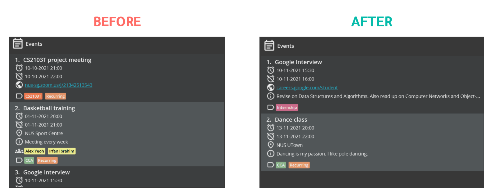

:information_source: **Note:**

Events that have ended **will not be shown**

#### Linking an event to contacts: `elink`

You can use `elink` to link your contacts to an event. This can be useful when you want to indicate the participants of an event, e.g. you can link your professors in the contact list to your lecture in the event list.

**Format:** `elink EVENT_INDEX c/CONTACT_INDEX [c/CONTACT_INDEX]…`

* Links the event at `EVENT_INDEX` to the contact(s) at `CONTACT_INDEX`.
* `EVENT_INDEX` refers to the index number shown in the displayed event list.
* `CONTACT_INDEX` refers to the index number shown in the displayed contact list.

:bulb: **Tip:**

`EVENT_INDEX` and `CONTACT_INDEX` **must be positive integers**, e.g. 1, 2, 3,…

**Examples:**

{: .example-table}
**Input 1** | `elink 2 c/1 c/2`
**Expected Output 1** | Links the second event in the **currently displayed** event list to the contacts with index **1 and 2** in the **currently displayed** contact list.   You should see this in your SoConnect: 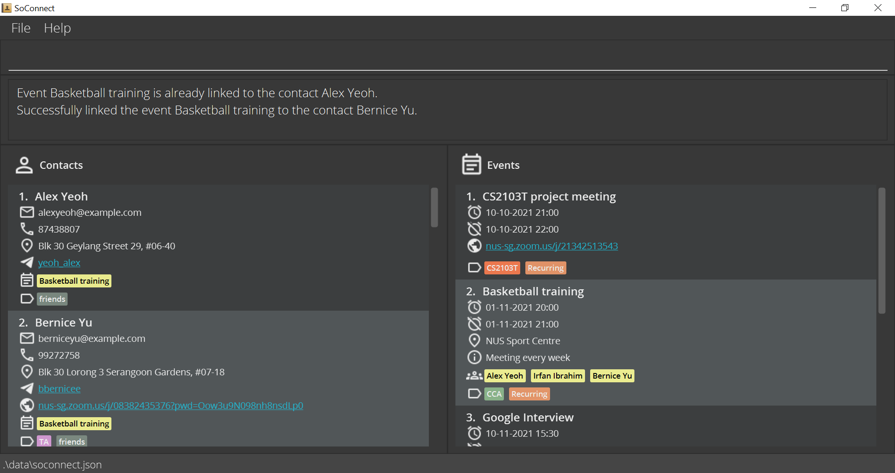

_See Also: [Unlinking an event from contacts](#unlinking-an-event-from-contacts-eunlink)_

#### Unlinking an event from contacts: `eunlink`

**Format:** `eunlink EVENT_INDEX c/CONTACT_INDEX [c/CONTACT_INDEX]…`

You can use `eunlink` to remove links between your contacts from an event. This can be useful if one or more of your contacts are no longer part of the event, so you can use `eunlink` to remove these links.

**Examples:**

{: .example-table}
**Input 1** | `eunlink 2 c/1`
**Expected Output 1** | Unlinks the second event in the **currently displayed** event list from the first contact in the **currently displayed** contact list.   You should see this in your SoConnect: 
| |
**Input 2** | `eunlink 2 c/*`
**Expected Output 2** | Unlinks the second event in the **currently displayed** event list from **all of its linked contacts**.   You should see this in your SoConnect: 

_See Also: [Linking an event to contacts](#linking-an-event-to-contacts-elink)_

### General

This section details all the other features and _commands_ available in SoConnect that can enhance your SoConnect experience:

**Basic** features:
* [Viewing help](#viewing-help-help)
* [Exiting SoConnect](#exiting-soconnect-exit)

**Advanced** features:
* [Redoing a _command_](#redoing-a-command-redo)
* [Undoing a _command_](#undoing-a-command-undo)
* [Opening the calendar](#opening-the-calendar-calendar)

#### Viewing help: `help`

You can use the `help` command whenever you are unsure of the _command format_.

**Format:** `help`

:bulb: **Tip:**

Alternatively, you can view the help window using the top menu bar via `Help -> Help` or press `F1`.

#### Exiting SoConnect: `exit`

You can use the `exit` command to close the SoConnect app.

**Format:** `exit`

:bulb: **Tip:**

Alternatively, you can exit SoConnect using the top menu bar via `File -> Exit`.

#### Undoing a _command_: `undo`

You can use the `undo` command to remove an undesired change.

**Format:** `undo`

**Examples:**

{: .example-table}
Input | [`cadd n/John Doe e/john@gmail.com`](#adding-a-contact-cadd) followed by `undo`
Expected Output | **Removes the added** contact from the contact list.

_See Also: [Redoing a command](#redoing-a-command-redo)_

:information_source: **Note:**

[Undo](#undoing-a-command-undo) and [redo](#redoing-a-command-redo) will only work for _commands_ listed in the
[Contact Management](#contact-management) and [Event Management](#event-management) features section.

_Commands_ listed in the [General](#general) section are not undoable.

#### Redoing a _command_: `redo`

You can use the `redo` command to restore a change that you accidentally undo.

**Format:** `redo`

**Examples:**

{: .example-table}
Input | [`edelete 1`](#deleting-an-event-edelete) followed by [`undo`](#undoing-a-command-undo) then `redo`
Expected Output | First **restores the deleted event** in the event list.  Then `redo` will **delete the same event again**.

_See Also: [Undoing a command](#undoing-a-command-undo)_

#### Opening the calendar: `calendar`

You can use the `calendar` command to display all your events in a calendar.

**Format:** `calendar`

* You can view the calendar in 4 different views:
    * Daily
    * Weekly
    * Monthly
    * Yearly
      

:bulb: **Tip:**

* Alternatively, you can view the calendar using the top menu bar via `File -> Calendar` or press `F2`.
* If an event does not have a specified end date and time, the calendar will treat the duration of the event as **one hour**.

:information_source: **Note:**

[Undo](#undoing-a-command-undo) and [redo](#redoing-a-command-redo) will not change the state of the calendar.
You should close the calendar window before performing any undo or redo operations.

:exclamation: **Caution:**
Any changes made in the calendar window will not be saved. 
**Do not attempt to add new events using the calendar window.** 
Doing so might result in a crash and your data may be lost.

--------------------------------------------------------------------------------------------------------------------

## SoConnect Saved Data

### Saving the data

SoConnect data is saved in the _hard disk_ automatically after any _command_ that changes the data.
There is no need to save manually.

### Editing the data file

SoConnect data are saved as a _JSON file_ `[JAR file location]/data/soconnect.json`.
Advanced users are welcome to update the data directly by editing that data file.

:exclamation: **Caution:**
If your changes to the data file make its [format](https://docs.fileformat.com/web/json/) invalid, 
SoConnect will **discard all data** and start with an empty data file at the next run.

--------------------------------------------------------------------------------------------------------------------

## Others

### FAQ

**Q**: How do I transfer my data to another Computer? 
**A**: Install SoConnect in the other computer and copy over the contents from your previous SoConnect _JSON file_ to the
empty data file SoConnect creates on the other Computer.

#### Copying Details and Opening Hyperlinks

**Q**: How do I copy the email address of a contact? 
**A**: You can copy any specific details of a contact or an event just by clicking on that detail.  
As shown on the image above, clicking on the `email` of `Charlotte Oliveiro` will copy her Email Address.

**Q**: Can SoConnect automatically open a hyperlink on my browser? 
**A**: You can open any hyperlinks that you have included in a contact or in an event. This includes telegram handles and Zoom meeting links. 

:bulb: **Tip:**

Clickable hyperlinks are <u>underlined in blue</u>

Referring back to the same image, if you click on the zoom link saved under `Charlotte Oliveiro`,
SoConnect will open the link on your browser automatically.

#### Linked Contacts and Events

**Q**: How do I view the contacts linked to a particular event? 
**A**: Click on the particular event card in the panel containing events.
Then click on the yellow boxes which are links to the contacts.
The linked contacts will be displayed on the contact panel on the left.

**Q**: How do I view the events linked to a particular contact? 
**A**: Click on the particular contact card in the panel containing contacts.
Then click on the yellow boxes which are links to the events.
The linked events will be displayed on the event panel on the right.

**Q**: What is the purpose of using links? 
**A**: Links are a form of **relationship between the contacts and the events** saved in SoConnect.
Typically, we link an event to a contact if the contact of a **participant** of the event.
For instance, you can link your professor to the lecture.

### How to start SoConnect using Terminal

Proceed only if you cannot start SoConnect using [this](#quick-start) method.

1. Open the terminal (For [MacOS](https://support.apple.com/en-sg/guide/terminal/welcome/mac) or Linux)
   or Command Prompt (For [Windows](https://www.howtogeek.com/235101/10-ways-to-open-the-command-prompt-in-windows-10/)).

2. Navigate to the folder containing `soconnect.jar`.
   See the tutorial for [Windows](https://www.howtogeek.com/659411/how-to-change-directories-in-command-prompt-on-windows-10/),
   [MacOS or Linux](https://www.macworld.com/article/221277/command-line-navigating-files-folders-mac-terminal.html)
   (Linux uses the same _command_ for navigating folders).

3. Enter the following _command_: `java -jar soconnect.jar`. The SoConnect window should open.

:bulb: **Tip:**

* If you are still unable to open the file,
  [check your Java version](https://www.java.com/en/download/help/version_manual.html)
  again and make sure it is version 11.
* [Download Java 11](https://docs.oracle.com/en/java/javase/11/install/overview-jdk-installation.html#GUID-8677A77F-231A-40F7-98B9-1FD0B48C346A) if you have not done so.
* Still not working? You may [contact](https://ay2122s1-cs2103t-w15-3.github.io/tp/AboutUs.html) the development team and report the issue.

--------------------------------------------------------------------------------------------------------------------
## List of _Prefixes_

<strong class="contact-heading">Contact Management</strong>

_Prefix_ | _Parameter_ Type
--------|------------------
**`a/`** | Address
**`dt/`** | Tag to be deleted
**`e/`** | Email Address
**`n/`** | Name
**`p/`** | Phone Number
**`t/`** | Tag
**`th/`** | Telegram Handle
**`z/`** | Links/ Websites

<strong class="event-heading">Event Management</strong>

_Prefix_ | _Parameter_ Type
--------|------------------
**`a/`** | Address
**`at/`** | Start Date and Time
**`c/`** | Contact index (for linking)
**`d/`** | Description
**`dt/`** | Tag to be deleted
**`end/`** | End Date and Time
**`n/`** | Name
**`t/`** | Tag
**`z/`** | Links/ Websites

## _Command_ Summary

<strong class="contact-heading">Contact Management</strong>

Action | Format, Examples
--------|------------------
**[Add](#adding-a-contact-cadd)** | `cadd n/NAME e/EMAIL [p/PHONE_NUMBER] [a/ADDRESS] [th/TELEGRAM_HANDLE] [z/ZOOM] [t/TAG]…​`   e.g. `cadd n/Alex Doe e/e0123456@u.nus.edu a/COM1 #99-99 th/johnDoe99 t/Professor`
**[Clear](#clearing-all-contacts-cclear)** | `cclear`
**[Delete](#deleting-a-contact-cdelete)** | `cdelete INDEX1[-INDEX2]`  e.g. `cdelete 3`   e.g. `cdelete 1-5`
**[Edit](#editing-a-contact-cedit)** | `cedit INDEX [n/NAME] [e/EMAIL] [p/PHONE] [a/ADDRESS] [th/TELEGRAM_HANDLE] [z/ZOOM] [dt/TAG_DELETED]…​ [t/TAG_ADDED]…​​`  e.g. `cedit 2 p/91234567 e/agentX@thehightable.com`   e.g. `cedit 1 n/Betsy Crower dt/*`
**[Find](#finding-contacts-cfind)** | `cfind [KEYWORD]… [e/KEYWORD…] [p/KEYWORD…] [a/KEYWORD…] [th/KEYWORD…] [z/KEYWORD…] [t/KEYWORD…]`  e.g. `cfind alex david`
**[List](#listing-all-contacts-clist)** | `clist [e/] [p/] [a/] [th/] [z/] [t/]`   e.g. `clist`   e.g. `clist e/ p/`
**[Mark](#marking-a-contact-cmark)** | `cmark INDEX`  e.g. `cmark 2`
**[Unmark](#unmarking-a-contact-cunmark)** | `cunmark INDEX [INDEX]…`  e.g. `cunmark 2`   e.g. `cunmark 2 3`
**[View](#viewing-a-contact-cview)** | `cview INDEX`  e.g. `cview 2`

<strong class="event-heading">Event Management</strong>

Action | Format, Examples
--------|------------------
**[Add](#adding-an-event-eadd)** | `eadd n/NAME at/START_TIME [end/END_TIME] [d/DESCRIPTION] [a/ADDRESS] [z/ZOOM] [t/TAG]…​ `   e.g. `eadd n/Summer Party at/12-12-2021 15:12 a/123, Clementi Rd, 1234665 t/fun`
**[Clear](#clearing-all-events-eclear)** | `eclear`
**[Delete](#deleting-an-event-edelete)** | `edelete INDEX1[-INDEX2]`  e.g. `edelete 3`   e.g. `edelete 1-5`
**[Edit](#editing-an-event-eedit)** | `eedit INDEX [n/NAME] [at/START_TIME] [end/END_TIME] [d/DESCRIPTION] [a/ADDRESS] [z/ZOOM] [dt/TAG_DELETED]…​ [t/TAG_ADDED]…​`  e.g. `eedit 2 n/CS2103T Exam dt/CCA t/Hard`   e.g. `eedit 3 dt/*`
**[Find](#finding-events-efind)** | `efind [KEYWORDS]… [at/KEYWORD…] [end/KEYWORD…] [d/KEYWORD…] [a/KEYWORD…] [z/KEYWORD…] [t/KEYWORD…]`   e.g. `efind meet`   e.g. `efind t/CS2103T Intern`
**[Link](#linking-an-event-to-contacts-elink)** | `elink EVENT_INDEX c/CONTACT_INDEX [c/CONTACT_INDEX]...`  `elink 2 c/1 c/2`
**[List](#listing-all-events-elist)** | `elist [at/] [end/] [d/] [a/] [z/] [t/]`   e.g. `elist`   e.g. `elist d/ at/`
**[Mark](#marking-an-event-emark)** | `emark INDEX`  e.g. `emark 2`
**[Sort](#sorting-events-esort)** | `esort`
**[Unlink](#unlinking-an-event-from-contacts-eunlink)** | `eunlink EVENT_INDEX c/CONTACT_INDEX [c/CONTACT_INDEX]...`  e.g. `eunlink 2 c/1`   e.g. `eunlink 3 c/*`
**[Unmark](#unmarking-an-event-eunmark)** | `eunmark INDEX [INDEX]…`  e.g. `eunmark 2`   e.g. `eunmark 2 4`
**[View](#viewing-an-event-eview)** | `eview INDEX`  e.g. `eview 1`

<strong class="general-heading">General</strong>

Action | Format, Examples
--------|------------------
**[Calendar](#opening-the-calendar-calendar)** | `calendar`
**[Exit](#exiting-soconnect-exit)** | `exit`
**[Help](#viewing-help-help)** | `help`
**[Redo](#redoing-a-command-redo)** | `redo`
**[Undo](#undoing-a-command-undo)** | `undo`

________________________________________________________________________________________________________________

## Glossary

Word | Explanation
--------|------------------
**Command Line Interface (CLI)** | Text-based application where users interact with the application by **typing in texts/ commands**.
**Command** | A sequence of words and characters you type to perform an action, each command has its own **_command format_**.
**Command Format** | The structure that a _command_ must abide by for it to be executed.
**Parameter(s)** | Information supplied by the user to the application when executing certain _commands_.
**Prefix** | A tag, consisting of a slash - "/" following one or a few characters to denote information about a certain **_field_**.
**Field(s)** | The information type within each contact or event   For example, **Name** and **Address** of a contact are _fields_ of a contact.
**Graphical User Interface (GUI)** | How the application appears to the user on his/her screen.
**Hard Disk** | Device in a computer that is specialized in storing data permanently.
**Home Folder** | Folder in which the application file and data from running the application is stored.
**JavaScript Object Notation (JSON) File** | The file that is used by the application to load and save data of the application in a human-readable format.
